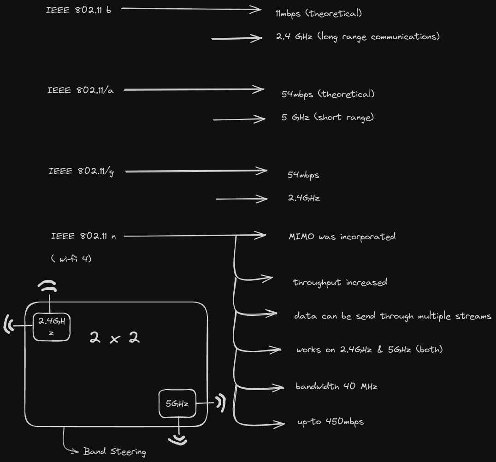

# Wi-Fi(Wireless Fidelity) IEEE 802.11 (WLAN)

### MINO
-> It is the method of multiplying the capacity of the radio link using multiple transmission and receiving antennas to exploit multi-path propagation 
-> It has become an important element of wireless communication standard which includes 

### Band Steering 
-> Routers at home with 4 antennas can support 2.4GHz and 5GHz when a device is connected on 5GHz bandwidth and moves away from the router signal, the 2.4GHz frequency will connect to the device automatically when you disconnect it from the 5GHz channel.

## TOPOLOGIES IN WIRELESS 
   ### Point to point link 
   -> The dual radio device transmitter acts with both channel configured as AP 

### 802.11 Standard identifier two modes
 
1. Infrastructure Mode

2. Independent basic service set (IBSS) 

   * IBSS is also known as ad-hoc mode 

### Basic Service Set (BSA)
  
* Basic Service Set consists of single Access Point interconnecting all the associated wireless clients.

### Basic Service Area (BSA)

* This is the area bounded by the reach of AP's signal. BSA is also called a cell

### Basic Service Set Identifier(BSSID) 

* This is a unique machine readable identifier for the AP that is MAC Address.

### Service Set Identifier (SSID)

* It is a human readable non-unique identifier used by access point to advertise its wireless service.

### Distribution System(DS)

* AP's connect to wired DS.

* An AP with a wired connection to the DS is responsible for translating frames between 802.3(Ethernet) and 802.11(Wireless Protocol)

### Extended Service Set(ESS)

* When a single BSS provides insufficient coverage to two or more BSS's can be joined through a common DS into an ESS. 

### Independent Basic Service Set(IBSS)

* Independent Basic Service Set is defined as two devices connected wirelessly in a peer to peer manner without the use of an access point.

* Here one device takes the role of advertising the wireless network to the client.

### Station Types

 * IEEE 802.11 defines three types of STA based on their mobility in a wireless LAN. 
    
    * NO Transition:
        * A station with no transition mobility is either stationary or moving only inside a BSS.
    
    * BSS Transition: 

        * If a client moves from BSS1 to BSS2 in an ESS. The station will transition to which 

    * ESS Transition:

        * A station with ESS Transition mobility can move from one ESS to another ESS, however IEEE 802.11 does not gurante that communication is continuous during the move. 

### Worldwide Interoperability for microwave Access(WI-MAX) 

 * It is an IEEE standard 802.16 for fixed wireless. 

 * IEEE 802.162 for mobile wireless network.

 * These aims to provide the last mile broadband wireless access alternative to **_cable modem_**, telephone DSL service 

 * It offers optimum range and throughput to line of sight subscribers.(advantage) 

 * Many users compare WI-MAX to WiFi.

 * WI-MAX like WiFi has a Base Station Infrastructure but it offers much more than WiFi.
   * greater security.
   * reliability.
   * Quality.
   * Quality of Service.
   * Throughput than WiFi.

 
# Li-Fi(Light Fidelity)

 * Li-Fi is a revolutionary wireless connection that can be upto 100 times faster than WiFi. 

 * It is a visible light communication system that transmits wireless internet communication at incredibly high speed, the technology works by using LED light bulb to emit light pulses that are invisible to human eye, within those pulses data can travel to and from receivers, once received data is collected and interpreted by the receiver

 * Transmission speed can exceed 100Gbps making it over 14 times faster than Wi-Gig, also know as world's fastest WiFi.

### NOTE
    
